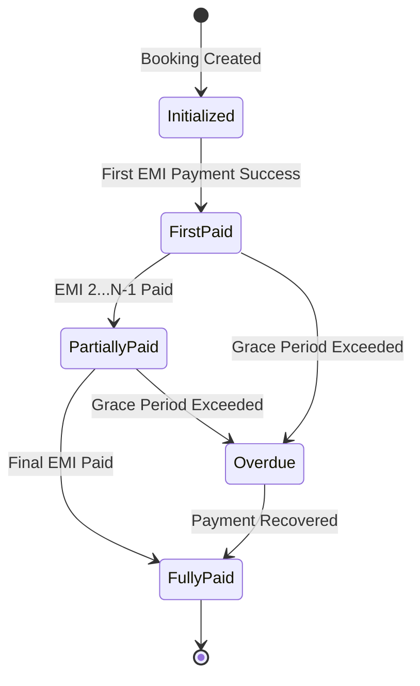

# Detailed EMI Plan & Implementation

This document outlines the end-to-end technical strategy for implementing the Prepaid EMI system, covering everything from database schema changes to the business logic for installment generation and payment state management.

## 1. EMI Business Logic & Calculations

### Core Principles

- **Prepaid Nature**: The first installment is paid at the time of booking to confirm it.
- **Tenure Options**: 3, 6, 9, or 12 months (customizable via slider).
- **Interest-Free**: Currently, the system assumes 0% interest (Total Package Price / Tenure).
- **Monthly Cycles**: Subsequent EMIs are due every 30 days from the booking date.

### Mathematics

- `EMI_Amount = floor(Total_Price / Tenure)`
- `Last_EMI_Adjustment = Total_Price - (EMI_Amount * (Tenure - 1))`
  > [!NOTE]
  > We use floor/adjustment to ensure the sum of installments exactly matches the total price without decimal floating point errors.

## User Review Required

> [!IMPORTANT]
> The current payment system uses an in-memory `paymentStore`. For EMI, we should consider persistent storage for installment schedules to ensure consistency across server restarts.

> [!WARNING]
> We need to decide if the EMI calculation should be purely server-side or if the server should trust the frontend's calculations (currently the frontend sends `emiAmount`).

## Proposed Changes

## 2. Database Schema Updates

### [MODIFY] [Booking.ts](file:///c:/Projects/Tripxplo/family.tripxplo.com/lib/models/Booking.ts)

We will add an `emiDetails` sub-document to the `Booking` model:

```typescript
emiDetails: {
  isEmiBooking: boolean;
  totalTenure: number;       // total months (e.g., 6)
  monthlyAmount: number;     // fixed EMI amount
  totalAmount: number;       // final price after discounts
  paidCount: number;         // number of installments paid
  nextDueDate: Date;         // date of next immediate EMI
  schedule: [
    {
      installmentNumber: number;
      amount: number;
      dueDate: Date;
      status: "pending" | "paid" | "failed";
      paymentId: string;     // ref to payment record
      transactionId: string;
      paidAt: Date;
    }
  ]
}
```

## 3. EMI Payment State Machine



## EMI API Specification

### 1. Initialize EMI Schedule

**Endpoint**: `POST /api/v1/emi/initialize`

- **Description**: Creates an EMI installment plan for an existing booking.
- **Auth**: Required

**Request Body**:

```json
{
  "bookingId": "BK-12345678",
  "tenureMonths": 6,
  "emiAmount": 1500,
  "totalAmount": 9000
}
```

**Successful Response (201 Created)**:

```json
{
  "success": true,
  "message": "EMI schedule initialized successfully",
  "data": {
    "bookingId": "BK-12345678",
    "emiDetails": {
      "totalTenure": 6,
      "monthlyAmount": 1500,
      "totalAmount": 9000,
      "paidCount": 0,
      "nextDueDate": "2024-01-15T00:00:00.000Z",
      "schedule": [
        {
          "installmentNumber": 1,
          "amount": 1500,
          "dueDate": "2024-01-15T00:00:00.000Z",
          "status": "pending"
        },
        {
          "installmentNumber": 2,
          "amount": 1500,
          "dueDate": "2024-02-15T00:00:00.000Z",
          "status": "pending"
        }
        // ... remaining installments
      ]
    }
  }
}
```

### 2. Pay EMI Installment

**Endpoint**: `POST /api/v1/emi/pay`

- **Description**: Initiates a payment for a specific installment.
- **Auth**: Required

**Request Body**:

```json
{
  "bookingId": "BK-12345678",
  "installmentNumber": 1
}
```

**Successful Response (200 OK)**:

```json
{
  "success": true,
  "message": "Payment initialized",
  "data": {
    "paymentId": "pay_xyz987",
    "paymentUrl": "http://localhost:3000/payment/pay_xyz987",
    "orderId": "BK-12345678",
    "amount": 1500,
    "currency": "INR",
    "installmentNumber": 1
  }
}
```

### 3. Get EMI Status & Schedule

**Endpoint**: `GET /api/v1/emi/status/:bookingId`

- **Description**: Retrieves current EMI progress and full payment schedule.
- **Auth**: Required

**Successful Response (200 OK)**:

```json
{
  "success": true,
  "data": {
    "bookingId": "BK-12345678",
    "packageName": "Golden Triangle Tour",
    "status": "partially_paid",
    "progress": {
      "paidCount": 2,
      "totalTenure": 6,
      "remainingAmount": 6000,
      "totalAmount": 9000
    },
    "nextInstallment": {
      "installmentNumber": 3,
      "amount": 1500,
      "dueDate": "2024-03-15T00:00:00.000Z"
    },
    "schedule": [
      {
        "installmentNumber": 1,
        "amount": 1500,
        "dueDate": "2024-01-15Z",
        "status": "paid",
        "paidAt": "2024-01-14Z"
      },
      {
        "installmentNumber": 2,
        "amount": 1500,
        "dueDate": "2024-02-15Z",
        "status": "paid",
        "paidAt": "2024-02-15Z"
      },
      {
        "installmentNumber": 3,
        "amount": 1500,
        "dueDate": "2024-03-15Z",
        "status": "pending"
      }
      // ...
    ]
  }
}
```

### 4. Updated Create Booking

**Endpoint**: `POST /api/v1/bookings`

- **Description**: Creates a booking and optionally initializes the EMI plan in one step.
- **Auth**: Required

**Request Body**:

```json
{
  "packageId": "PKG-001",
  "travelDate": "2024-05-20",
  "adults": 2,
  "finalPackagePrice": 9000,
  "emiMonths": 6, // Optional: Present for EMI bookings
  "emiAmount": 1500, // Optional: Monthly installment
  "totalEmiAmount": 9000 // Optional: Total value of EMI plan
}
```

**Successful Response (201 Created)**:

```json
{
  "success": true,
  "data": {
    "booking": {
      "id": "BK-12345678",
      "packageName": "Golden Triangle",
      "totalAmount": 9000,
      "status": "pending",
      "isEmiBooking": true,
      "emiDetails": {
        "monthlyAmount": 1500,
        "totalTenure": 6
      }
    }
  }
}
```

### 5. Updated Process Payment

**Endpoint**: `POST /api/v1/payment/process`

- **Description**: Finalizes a payment. Correctly updates EMI schedule if it's an installment payment.
- **Auth**: Required

**Request Body**:

```json
{
  "paymentId": "pay_xyz987",
  "paymentMethod": "upi"
}
```

**Successful Response (200 OK)**:

```json
{
  "success": true,
  "data": {
    "transactionId": "txn_654321",
    "status": "completed",
    "isEmiPayment": true,
    "installmentNumber": 1,
    "paidCount": 1,
    "totalTenure": 6,
    "bookingStatus": "confirmed" // First EMI payment confirms booking
  }
}
```

### 6. Error Handling

| Code                 | Message                          | Description                             |
| -------------------- | -------------------------------- | --------------------------------------- |
| `EMI_ALREADY_EXISTS` | EMI schedule already initialized | Attempted to re-init an active EMI plan |
| `INVALID_TENURE`     | Selected tenure is not supported | tenureMonths must be 3, 6, 9, or 12     |
| `INSUFFICIENT_FUNDS` | Payment failed                   | Generic payment failure code            |

### 4. Security Considerations

- **Authentication**: All endpoints require a valid JWT passed in the `Authorization` header.
- **Ownership**: The server must verify that the `bookingId` belongs to the authenticated `userId`.
- **Integrity**: amount and tenure are validated against the original booking price to prevent manipulation.

### 2. New EMI API Endpoints

#### [NEW] `POST /api/v1/emi/initialize`

- **Purpose**: Initialize an EMI schedule for an existing booking.
- **Request**: `{ bookingId: string, tenureMonths: number }`
- **Response**: Full schedule with installment amounts and due dates.

#### [NEW] `POST /api/v1/emi/pay`

- **Purpose**: Initiate payment for a specific installment.
- **Request**: `{ bookingId: string, installmentNumber: number }`
- **Response**: Payment session/link details.

#### [NEW] `GET /api/v1/emi/status/:bookingId`

- **Purpose**: Retrieve the current status of an EMI plan.
- **Response**: Current installment, remaining balance, and payment history.

### 3. Integrated Flow Changes

#### [MODIFY] `POST /api/v1/bookings`

- Update to handle EMI-specific fields from the request body and save them to the database.

#### [MODIFY] `POST /api/v1/payment/process`

- Detect if the payment belongs to an EMI installment and update `paidEmis` and `emiSchedule` accordingly.

## Verification Plan

### Automated Tests

- Create shell scripts or use `curl` to:
  1. Create a booking with EMI options.
  2. Initialize EMI schedule.
  3. Pay the first installment.
  4. Verify the booking status and paid installments count.

### Manual Verification

- Use the updated frontend to complete a booking with EMI.
- Check the "Booking Details" page to ensure the EMI progress bar and schedule reflect the payment correctly.
